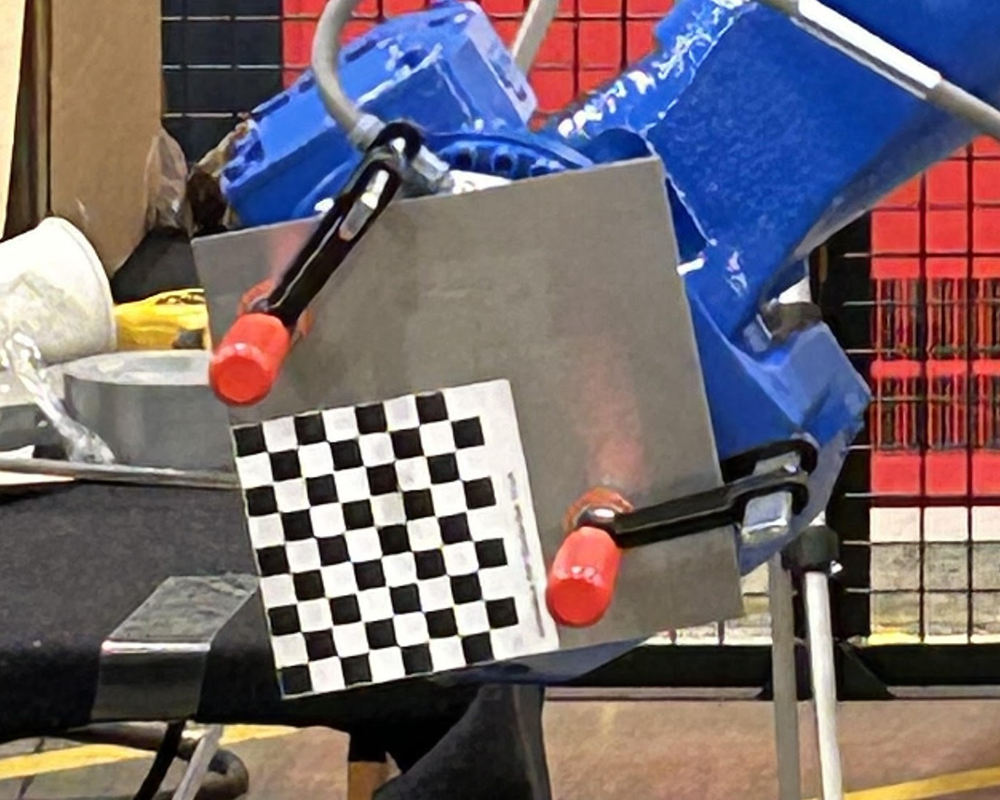
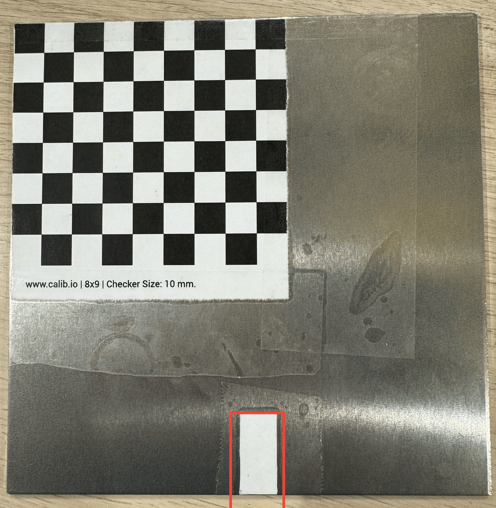
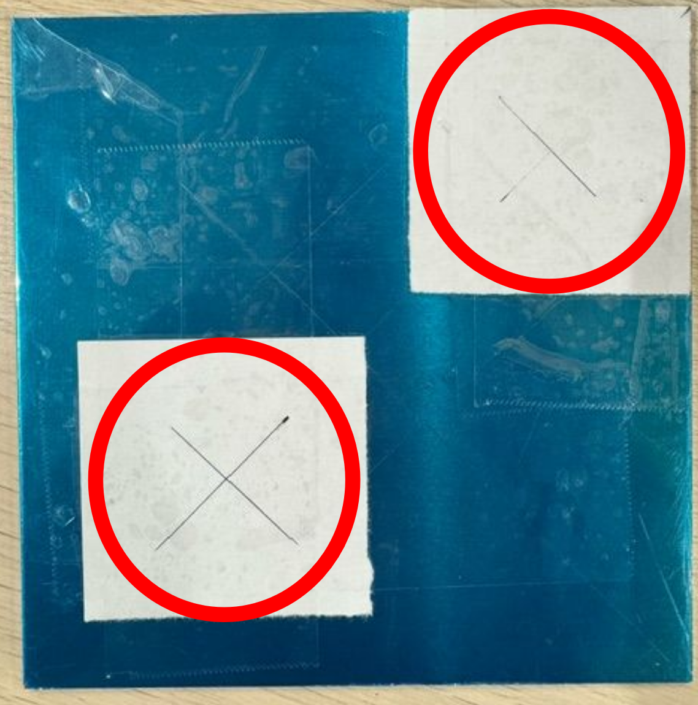

# MASCEI Disposable Line CDR Demo Procedures

## Setup Camera
Using the tripod, place the camera such that it faces towards the bagger machine.
Check that the whole bagger machine can be seen by the camera.
To do that, use `realsense-viewer`.

## Check robot profile

Make sure that the following files are read for `gp7`:

- `1_hand_eye_calibration.cpp:302,304`
- `2_tool_calibration.cpp:304,306`

## Navigate to the workspace
Navigate to `/home/icl/Documents/MASCEI_root/MASCEI/Auto_calibration`.
All following commands should be ran from this directory.

## Hand-eye Calibration

### 1. Fix marker to the end-effector via clamps/tape/etc.
The marker can be fixed at arbitrary location and orientation, as long as it remains fixed with respect to the end-effector.


### 2. Manually move the robot such that the marker is seen by the camera.
Check via `realsense-viewer`.


### 3. Run calibration
Prepare the robot for accepting control commands, then run
```
build/cfslib_hand_eye_calibration
```
The robot will move to different poses and the camera will detect the marker pose and save the results.
By default, the program stops after recording 15 robot poses.
This number can be tuned by changing `N_CALIB_POSES_MAX` in `1_hand_eye_calibration.cpp`.
Then, run
```
build/cfslib_hand_eye_calibration_evaluation
```
The hand-eye calibration result will be then saved to `config/cam_calibration/845112072047/hand_to_eye_calib_mat.txt`.

## Environment Calibration

Before running the following, make sure the bagger machine can be seen by the camera.
This should be already guaranteed by the camera placement design.

1. Go to `http://localhost:7000/` in browser. For now nothing will be displayed.
2. Run `python src/Test/3_environment_calibration.py`
3. As windows pop out, press `ESC` to close window.
4. After the calibration, the browser interface will show the scene point cloud in black, globally detected point bagger machine pose in yellow, and ICP fine tuned pose in green.
5. The environment calibration result is printed in command line.

## Tool Calibration

### 1. Attach marker to the gripping point

Follow either of the following, depending on the gripper type.

#### Two-finger Gripper
Close the gripper such that the rubber part on the finger overlaps the thin white area on the board, which is marked in red in the following image.



The gripper finger has the same size as the white area, hence make sure the finger overlaps exactly the white area.

Change `use_two_finger_gripper` in `2_tool_calibration.cpp` to `true`.

#### Suction Gripper
Grip on the back of the marker plate such that the two suction heads match the rectangle areas.
That can be done by aligning the caps with the red circles marked in the following image.




Change `use_two_finger_gripper` in `2_tool_calibration.cpp` to `false`.

### 2. Manually move the robot such that the camera sees the marker. Use `realsense-viewer` to check.

### 3. Run tool calibration

Make sure to build before running since the tool switch requries re-compilation.
```
cd build/
make -j12
cd ../
build/cfslib_tool_calibration
```
The result will be printed in command line as `mat_flange2tool`.

## V-rep Simulation 

### 1. open the V-REP, the v-rep folder is on the /Document/MASCEI_root/CoppeliaSim_Edu_V4_6_0_rev18_Ubuntu20_04.

### 2. run ./coppeliasim.sh to the v-rep

### 3. load yaskawa pick and place scene, which is on the on the /Document/MASCEI_root/RACER_simulation_CDR_withpick_multi_box_release.ttt
